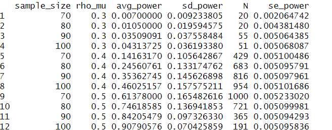
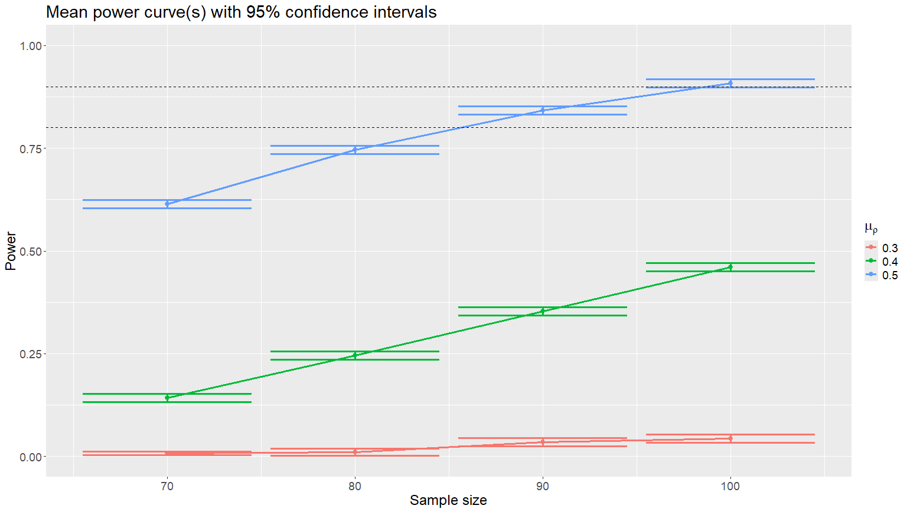

```{r, include = FALSE}
knitr::opts_chunk$set(
  collapse = TRUE,
  comment = "#>"
)
```

```{r setup}
library(EpipwR)
```

### Introduction

EpipwR is a quasi-simulation based approach to power analysis for epigenome-wide association studies (EWAS) with a continuous or binary outcome variable. It is fast, efficient and allows the exact level of precision to be set by the user. EpipwR is the first open source tool able to calculate power for EWAS with a continuous outcome. For binary outcomes, it re-implements the pwrEWAS methodology (Graw et al., 2019 - currently available on GitHub) with a few changes and significantly improves the computation time.  EpipwR is simple in that it has three main functions: `get_power_cont()` and `get_power_cc` calculate power for various settings with continuous and binary outcomes (respectively) and `EpipwR_plot()` plots the output. The following vignette describes in detail the EpipwR workflow for an analysis of a continuous outcome.

### Methodology (Continuous Outcome)

Suppose an upcoming EWAS plans to analyze the methylation levels at $K$ CpG sites and some continuous outcome $Y$. Of the $K$ CpG sites, it is assumed that only a subest of these ($K_m$ ) have non-zero correlation to $Y$. The goal of EpipwR is to determine the level of power achieved by this study at a given sample size $n$, where power is defined as the proportion of the $K_m$ CpG sites are found to have a statistically significant association with $Y$.

To begin, EpipwR generates data for the $K_m$ CpG methylation levels and for $Y$. Users specify $\mu_\rho$ and $\sigma_\rho$, the average and standard deviation of the correlation between each of the $K_m$ methylation levels and $Y$. If users prefer that all $K_m$ methylation levels have equal correlation with $Y$, then $\sigma_\rho$ can be set to 0. Like many power analysis tools, EpipwR assumes no correlation across CpG sites (i.e., they are conditionally independent given $Y$). Users also select which empirical EWAS data to use to generate initial methylation levels. Full details of the data generation process can be found in the corresponding EpipwR article (Barth and Reynolds, 2024).

Once a dataset has been generated, p-values are calculated by performing the specified hypothesis test (Pearson, Spearman or Kendall correlation) for each $K_m$ site. Please note that in absence of any "vertical" correlation or additional covariates, performing a standard analysis in limma is equivalent to using the Pearson correlation test. Users can specify either a false discovery rate or family-wise type I error rate correction for determining statistical significance. If the false discovery rate is selected, p-values for the remaining null tests are generated via a $Uniform(0,1)$ distribution.

Since the process described above is based heavily on random sampling, it must be repeated on several data sets to produce a reliable power estimate. Whereas traditional tools require the user to specify the number of repetitions, EpipwR sets 20 to the minimum number of data sets, allows users to set a maximum number of data sets and a level of precision in the form of a 95% confidence interval margin of error. Anytime after the first 20 datasets, EpipwR terminates once one of these two conditions are met. The default margin of error is 3% (it is recommended that this be between 1 and 5%). For example, if the target margin of error is 3% and the maximum number of data sets is 1000, then the algorithm stops when $N=1000$ or once the following conditions are met:

$$1.96\cdot\frac{s_{(N)}}{\sqrt{N}}<.03,\qquad N\ge20
$$

where $s_{(N)}$ is the standard deviation of average power over $N$ data sets.

### Function Inputs

The below table describes the details of the `get_power_cont` inputs.

|                      |                                                                                                                                       |
|-----------------|-------------------------------------------------------|
| **Parameter**        | **Description**                                                                                                                       |
| `dm`                 | The total number of non-null tests (i.e., the number of CpG sites with methylation having a non-zero correlation with the phenotype). |
| `Total`              | The total number of tests (i.e., total number of CpG sites in the study).                                                             |
| `n`                  | The sample size of the study - accepts a vector of values.                                                                            |
| `fdr_fwer`           | Either the false discovery rate (FDR) or the family-wise type I error rate (FWER), depending on `use_fdr.`                            |
| `rho_mu`             | The average correlation of the non-null tests - accepts a vector of values.                                                           |
| `rho_sd=0`           | The standard deviation of the correlation for non-null tests.                                                                         |
| `Tissue="Saliva"`    | Tissue corresponding to empirical EWAS data (see `?get_power_cont` for valid options).                                                |
| `Nmax=1000`          | The maximum number of data sets that EpipwR will use to determine power. Cannot be less than 20.                                      |
| `MOE=.03`            | The target margin of error of a 95% confidence interval for average power.                                                            |
| `test="Pearson"`     | Type of correlation/test utilized. Acceptable inputs are `"Pearson"`, `"Kendall"` and `"Spearman"` .                                  |
| `use_fdr=T`          | Indicates that the false discovery rate should be used as the correction. Otherwise, uses FWER.                                       |
| `Suppress_Updates=F` | If `T` , removes intermediate status updates.                                                                                         |

### Methodology (Binary outcome)
For the case-control setting, EpipwR re-implements the pwrEWAS methodology (Graw et al., 2019) with a few key changes to improve speed and interpretation, namely (1) keeping the precision equal between groups rather than variance, (2) requiring users to specify mean and variance for an effect size distribution (rather than a target maximal difference) and (3) generating p-values directly for null tests. Like in `get_power_cont`, `get_power_cc` calculates the optimal amount of data sets needed to determine power at a user-specified level of precision.  

### EpipwR Workflow

Suppose the user is planning an EWAS of 100,000 CpG sites with an estimated 100 of those having a non-zero correlation with continuous phenotype. They would like to test sample sizes of 70, 80, 90, 100 and fixed correlations of 0.3, 0.4 and 0.5. They plan to use an FDR of 5% on Pearson correlation tests, the Saliva empirical EWAS and 1,000 as the maximum number of data sets. Since they hope to have very accurate results, the margin of error is set to be 1%. They would then execute the following code:

``` r
output <- get_power_cont(
  dm=100
  ,Total=100000
  ,n=c(70,80,90,100)
  ,fdr_fwer=.05
  ,rho_mu = c(0.3, 0.4, 0.5)
  ,rho_sd = 0
  ,Tissue = "Saliva"
  ,Nmax=1000
  ,MOE=.01
  ,test="pearson"
  ,use_fdr=T
  ,Suppress_updates=F
)

output
```

which produces the following data frame.



Note that executing this code block will produce very similar but not identical results, since EpipwR is based on random sampling. The first two columns track the setting for which power was calculated (each row is a unique combination of `n` and `rho_mu` ). The next four columns show the average power for this setting, the standard deviation of power, the number of data sets used for this setting, and finally the standard error of the average power (column 4 divided by the square root of column 5). Note that when power is very close to 0, often the minimum number of data sets is sufficient to achieve the desired level of precision - the same is true when power is close to 1.

Finally, users can also summarize the output with error bar plots with `EpipwR_plot(output)`. For our previous example, this produces the following plot:

{width="700"}

Please note that `EpipwR_plot` can only run with the data frame output of `get_power_cont` or `get_power_cc` - it will not work with data in any other format.

```{r}
# Load sessioninfo package
library(sessioninfo)

# Display session information
session_info()
```

# References
Barth, J., Reynolds, A.W. (2024). EpipwR: Efficient Power Analysis for EWAS with Continuous Outcomes [preprint].
*bioRxiv*, 2024.09.06.611713; doi: https://doi.org/10.1101/2024.09.06.611713

Graw, S., Henn, R., Thompson, J. A., and Koestler, D. C. (2019). pwrEWAS: A user-friendly tool for comprehensive power estimation for epigenome wide association studies (EWAS). *BMC Bioinformatics*, 20(1):218.
